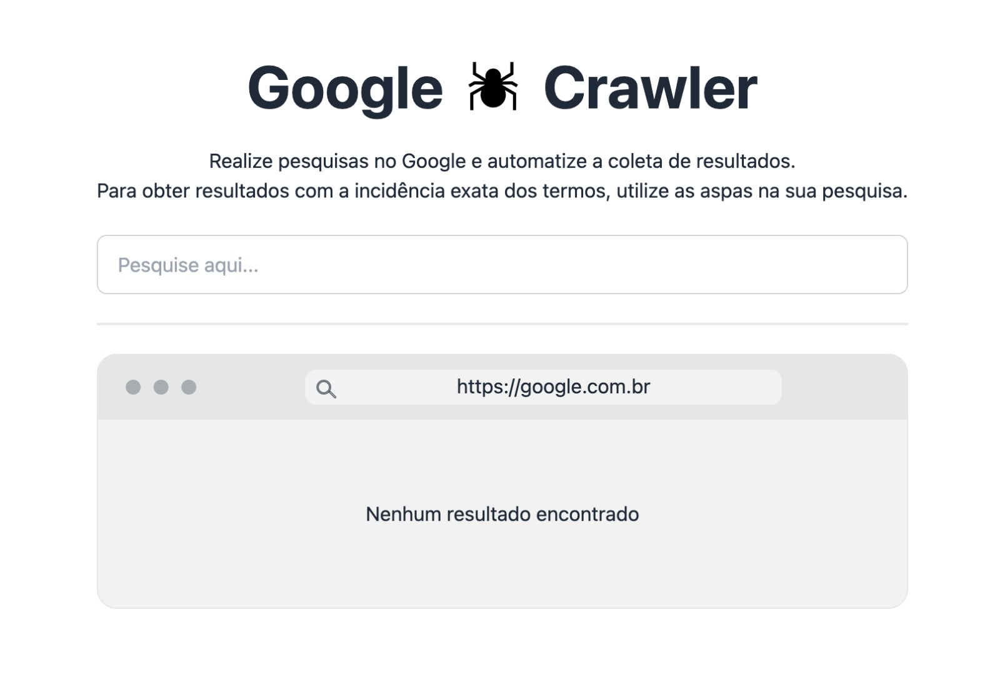

# Google Crawler

Um web crawler desenvolvido para capturar links do Google, baseados em uma pesquisa.

O objetivo incial dessa ferramenta era buscar por imobiliárias de determinadas cidades.

Ex: "Imobiliária em Atibaia". 

### Melhorar
- Implementar Puppeteer
- Opção de baixar a lista obtida em CSV
- Acessar cada link encontrado, e buscar pelo telefone e email da imobiliária